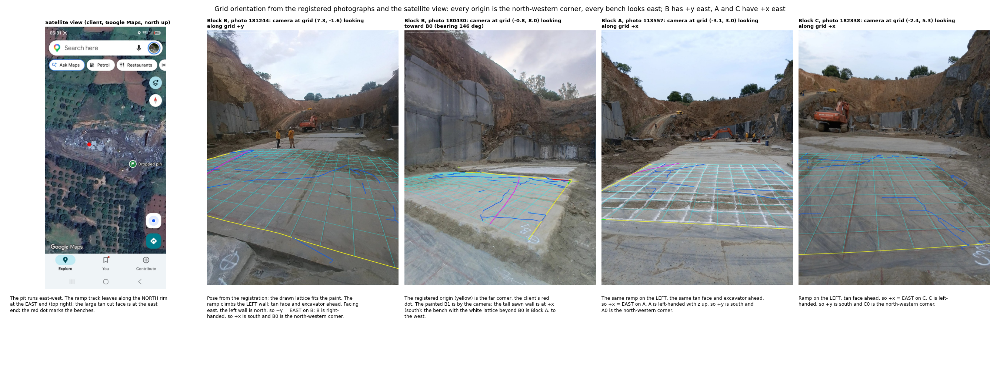

# Orientation of the painted grids: where east is, and which corner the origin is

The client, who laid the grids, states three things: the benches all look east; every
origin corner (A0, B0, C0) is the north-western corner of its block; on Block B east is
the direction from B0 toward B1. PARSAN's report reads increasing x as east and the 6 m
side of Block B as north–south. This note tests the client's statements against the
data that exist, without a compass reading.

## What was used

1. **Registered camera poses.** Every photograph's position and view direction is known
   in its block's grid frame from the photogrammetry (`tables/cameras_X.json`) and the
   grid registration (`dataset/bench_frame_m/Block_X/FRAME.json`). The registration was
   verified by drawing the lattice back into the photographs (`figs/REPROJ_*.jpg`): it
   lands on the paint, so a photograph's view bearing in grid coordinates is trustworthy.
2. **What the photographs show.** The pit is a trench with two long walls. One end has a
   haul ramp climbing one wall to the rim (a yellow generator parked at the top), a big
   tan overburden face, and an excavator; the other end has more benches and a rough
   wall.
3. **The client's satellite view** (Google Maps, north up): the pit runs east–west; the
   ramp track leaves along the north rim at the east end; the large tan cut face is at
   the east end; the red dot marks the benches.
4. **The block meshes**: high ground (z above 1.5 m) around each bench, in grid axes.
5. **Sun position** at the photograph times (EXIF): Block A 11:33 IST, sun azimuth 89°,
   elevation 78° (shadows too short to use); Blocks B and C 18:04 to 18:34, sun azimuth
   282°, elevation 7° to 0°, overcast and below the pit wall (no usable shadows or glow).
   No photograph carries a GPS heading. The field sketches carry no north arrow.

## The chain, block by block

**Block B.** Photograph 181244 was taken from grid (7.3, −1.6) looking along grid +y
(bearing 342°). It shows the ramp climbing the wall on the LEFT, the tan face and the
excavator straight ahead. The ramp is on the north rim at the east end of the pit, so
the camera looks east, and the left-hand wall is the north wall: **grid +y is east**.
The B grid is right-handed with z up (`FRAME.json`), so facing east +x is on the right,
to the south. Then x = 0 is the north edge and y = 0 the west edge: **B0 is the
north-western corner**, B1 (0, 6) the north-eastern, B3 (9.5, 0) the south-western.
Photograph 180430, from grid (−0.8, 8.0) looking toward B0, agrees: the registered
origin is the far corner (the client's red dot), the painted B1 is by the camera, the
tall sawn wall is at +x (the south wall, 8.5 m from the bench centre in the mesh), and
the bench with the white lattice beyond B0 lies to the west (it is Block A).

**Block A.** Photograph 113557, from grid (−3.1, 3.0) looking along grid +x (bearing
96°), shows the same ramp on the LEFT, the same tan face and excavator ahead: **grid +x
is east** on A. The A grid is left-handed with z up, so facing east +y is on the right,
south: y = 0 is the north edge and x = 0 the west edge, **A0 is the north-western
corner**. The mesh's high ground at +x (bearing 72°) is the far end wall.

**Block C.** Photograph 182338, from grid (−2.4, 5.3) looking along grid +x (bearing
82°), shows the ramp on the LEFT and the tan face ahead: **grid +x is east** on C. The C
grid is left-handed, so +y is south and **C0 is the north-western corner**.

## Verdict

All three of the client's statements hold: every bench looks east toward the ramp end,
every origin is the north-western corner, and on Block B east runs from B0 toward B1.
The report's "increasing x is east" is right for A and C and wrong for B, whose grid
was painted with its 9.5 m side across the trench; on B east is +y. The report's "6 m
north–south extent" on B is therefore also wrong: the 6 m side runs east–west.

What this rests on: the ramp being on the north rim at the east end in the satellite
view, which the client's screenshot shows and which a compass on site confirms in a
minute. The cutting order on the page uses these axes (`guillotine_pack.py`, `EAST`);
if a compass says otherwise the order flips and the cuts do not change.

| block | east axis | origin corner | handedness (z up) | source |
| --- | --- | --- | --- | --- |
| A | +x | A0 north-west | left | photo 113557 |
| B | +y | B0 north-west | right | photos 181244, 180430 |
| C | +x | C0 north-west | left | photo 182338 |

## Confirmed by the client on the mesh, 11 September

Asked directly which side of Block B runs east, the client confirms from the photogrammetry mesh
that **the shorter, 6 m side runs east**: B0 to B1 is the east direction, so +y is east on B and
+x is south. That is the reading already used everywhere here and in the cutting order, and it is
unchanged. Note that B0 sitting at the north-western corner is true under either reading and does
not by itself decide the question; the length of the side that runs east does.

### What the dip directions become

| surface | grid bearing of dip | azimuth | reading |
| --- | --- | --- | --- |
| A-1 | 328 | 212 | dips SSW at 29 deg |
| A-2 | 359 | 181 | dips S at 35 deg |
| B-1 | 094 | 184 | dips S at 8 deg, direction poorly determined |
| B-2 | 347 | 077 | dips ENE at 20 deg |
| C-1 | 026 | 154 | dips SSE at 7 deg, direction poorly determined |
| C-2 | 179 | 269 | dips 2.5 deg, direction not determined at all |

Grid bearing runs 0 at +y and 90 at +x. It becomes an azimuth through the handedness: on A and C
+x is east and +y south, so azimuth = 180 minus bearing; on B +y is east and +x south, so azimuth =
bearing plus 90. Only A-1, A-2 and B-2 have a dip direction worth quoting; the other three are too
close to flat, and C-2's local dip directions scatter over 101 degrees.

The surface names carried an older reading and are corrected: B-1 was labelled "dips east" and dips
south; A-1 was labelled "NW" although it covers the whole bench and dips SSW; A-2's "+y" is south.

### The registration was read wrongly, and now confirms the reading

An earlier draft of this note recorded that registering the three models into one frame contradicted
the +y reading on Block B. That was an error of mine, not a disagreement in the data, and it is
withdrawn.

The mistake: a block's mesh frame is **not** its painted grid frame. Each `FRAME.json` carries the
grid's own origin and axis directions inside the mesh frame, and a grid corner at (X, Y) metres sits
at `origin x scale + X * x_dir + Y * y_dir`. Those axes are rotated differently in each block, by
16 degrees on A, 272 on B and 347 on C. I had compared mesh axes and called them grid axes.

The mapping is confirmed against the paint itself. Block A's grid is white lime: points within 4 cm
of a predicted grid line are 10.9 brightness units lighter than points between the lines, and under
the mesh-axis assumption that signal drops to 0.2.

Read correctly, the registration agrees with the client:

| block | painted east axis, expressed in the site frame | corner picked by hand in the model |
| --- | --- | --- |
| A, +x east | 342.2 deg | 343.4 deg |
| B, +y east | 342.3 deg | 343.3 deg |
| C, +x east | 346.6 deg | 346.2 deg |

The three east axes span 4.4 degrees, so they are parallel on the ground, which is what the client
said from the start: the same convention and the same orientation on all three benches. The corners
clicked by hand in the site model land within 1.2 degrees of the axes the frame files predict, on
every block, which is independent of both the registration and the photographs.

One indication still points the other way and is kept here: of the three surfaces whose dip
direction is well determined, A-1, A-2 and B-2 span 45 degrees under this reading and 17 degrees
under the other. Three benches need not share one joint set, so this is weak, but it is unexplained.

**A compass bearing on the B0 to B1 line would still close the question outright**, and costs a
minute on the next visit. Nothing about the cuts depends on it; the order of removal and every
compass direction in these documents do.

## Block C was turned ninety degrees in the site model, 12 September

The verdict above is unchanged and was never in doubt. This is an error downstream of it, in the
whole-pit model rather than in the orientation reading, and it was live on the published page.

**What happened.** When the three benches were pinned to corners clicked by hand on the point
cloud, a helper had to decide which grid axis the first clicked side ran along. It decided by
length: the side that came closest to the grid's x extent was called x, and the side closest to the
y extent was called y, with the frame file consulted only to break a tie on Block A, which is
square. On Block C the clicked corners are loose — the three clicked sides measure 8.83, 9.20 and
9.12 m against a painted grid of 7.0 by 8.0 — and 8.83 is nearer 8 than 7, so the side that is
really the 7 m side was labelled y. Block C's grid was thereby transposed, and with it the fifteen
planned blocks, the survey lines, the picked points and the two C surfaces, all rotated ninety
degrees on the bench in the site view.

**How it was caught.** By asking a question the data must answer the same way twice: one crew
painted all three grids, so the three east axes have to be parallel on the ground. Read through the
frame files they are, at 103.4, 107.7 and 107.8 degrees in the site frame. Read through the pinned
rings, Block C came out perpendicular to the other two. That is not a disagreement about where east
is; it is one grid lying on its side.

**The fix.** The frame file now decides the axis labelling on every block, not only on a square one.
The clicked corners still supply where the grid sits and how it is turned, which is what they are
good for; they no longer name the axes, which they are not. A clicked length a metre out cannot be
asked to choose between axes a metre apart.

**After the fix**, the three east axes read 105.0, 103.3 and 103.0 degrees in the site frame — a
spread of 2.1 degrees, tighter than the 4.4 of the frame files alone, because the clicked corners
supply the rotation. Block C's outline maps to a clean 7 by 8 rectangle, all 42 planned blocks fall
inside their benches, and all six surfaces sit wholly within the bench they belong to, C-2 filling
its own 7 by 8 exactly.

**What was affected and what was not.** Nothing in the plan itself: the blocks are planned in grid
coordinates and the tonnages, classes, cut counts and clearances are unchanged, as are the dips,
the dip directions and the stereonet, which are computed per block in that block's own frame. What
was wrong was where Block C's grid was drawn in the combined site model: the whole-pit view on the
page, the standalone viewer, and the three films. All have been rebuilt. The per-block A, B and C
views on the page never used the site frame and were never affected.
