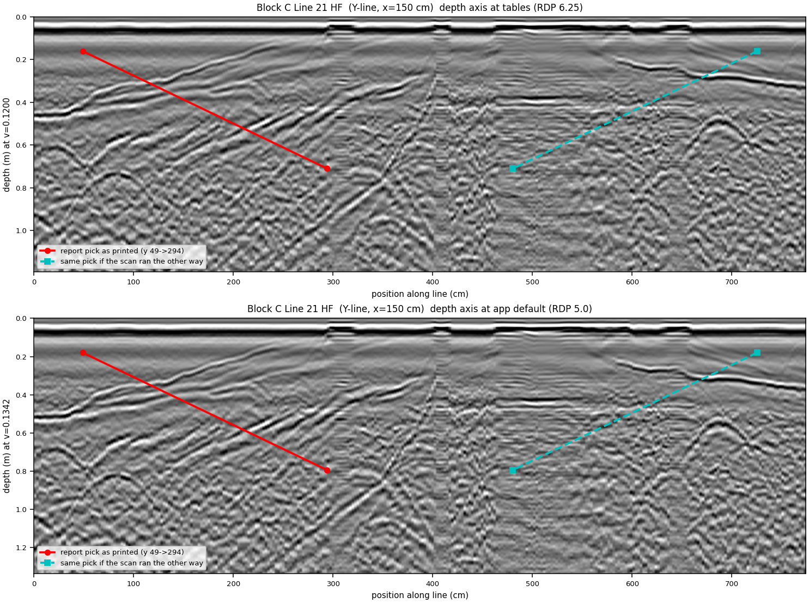
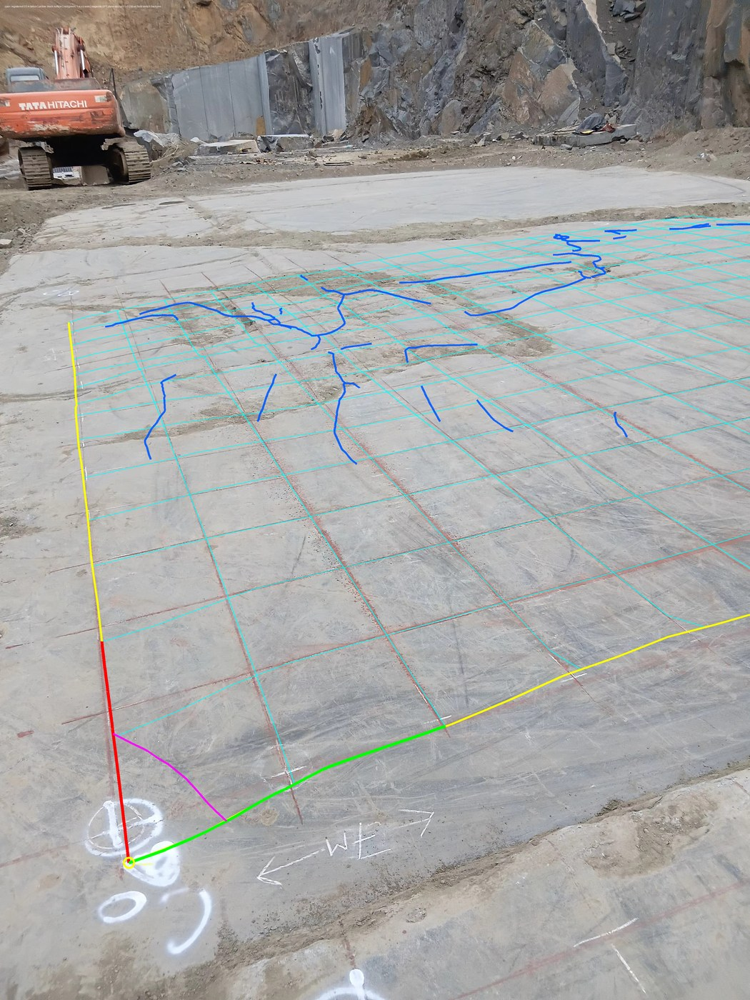
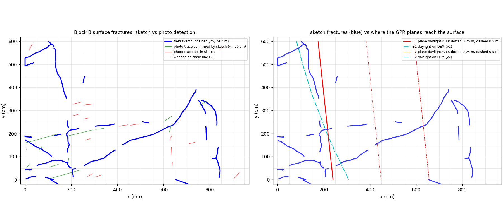
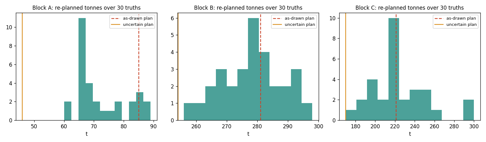
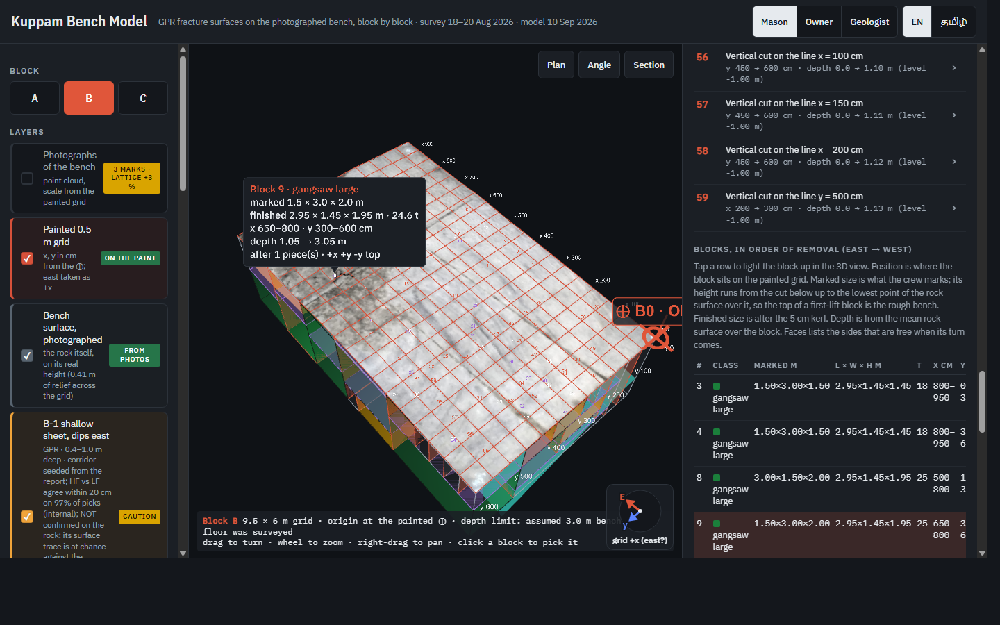

# Kuppam dolerite benches: GPR fracture model, verification, and block yield

Libish M, 10 September 2026. Survey by PARSAN Overseas, 18 to 20 August 2026; report
revised 9 September; raw data received 9 September; this model built 9 and 10 September.

**Interactive model:** https://libishm1.github.io/Kuppam_granite-deposit_GPR-Fracture_study/
(3D, per block, layers with their checks stated; a Cutting view with the straight-cut plan,
its dependencies and its order for the maestry, a Yield view for the office with both
clearance cases, a Radar view for the geologist with every raw line and the picks on
it, a How-sure view with the uncertainty of every surface; English and Tamil; phone and
desktop).
Private copy: https://claude.ai/code/artifact/59ea49e0-aba8-45c8-ac58-595fa29f9424

---

## 1. In one page

Three benches of fine-grained dolerite at Kuppam were scanned with a Proceq GS8000 on
a 0.5 m painted grid: Block A 5.5 x 5.5 m, B 9.5 x 6.0 m, C 7.0 x 8.0 m. PARSAN
interpreted six fracture surfaces. This work re-picked all six from the 178 raw SEG-Y
files, put them on the photogrammetry of each bench by finding the painted grid in the
mesh colours, corrected them to the real bench surface, added the fractures the crew
chalked on the rock, and packed saleable blocks between everything.

| what | result |
| --- | --- |
| six GPR surfaces | all six rebuilt from raw data; of the four with published picks, three tie to the report inside 10 cm and all four inside 20 cm; B-1 and A-2 had no published depths and are checked indirectly |
| position on the rock | each grid found in its mesh to a few cm (A, C) or ~10 cm (B); origins on the crew's painted marks; proven by drawing the model back into the photographs |
| surface cracks | 78 chained traces from the field sketches, 15 to 34 m per block; the photo-based detector was tested and found no better than chance, so it is not relied on |
| candidate blocks in straight cuts, chalked cracks assumed 1 m deep, surfaces kept clear by their uncertainty | A 46 t, B 254 t, C 170 t; as drawn (best case) A 85, B 281, C 221 t. Not a promise: section 7 |
| the biggest unknowns | how deep the chalked cracks go, and how far each surface really is from where it is drawn: the uncertain and as-drawn cases in section 7 bracket it |
| the biggest finding | the steep joint set that will control how blocks split is on the sketches and not in the radar; this survey (0.5 m lines, 2D, unmigrated) does not constrain steep fractures |

Everything here regenerates from `scripts/`. Every figure named below is in `figs/`.

## 2. Data

| item | detail |
| --- | --- |
| instrument | Proceq GS8000 S/N GS80-001-0145; stepped-frequency; HF channel peaks at 628 MHz, LF at 358 MHz (measured from the direct wave on all 89 lines, `tables/spectra.json`; not the report's "500 MHz nominal") |
| lines | 89: A 24, B 33, C 32; 2.49 cm trace spacing; HF 40 ns / LF 81 ns windows |
| coordinates | none in the raw data: every trace header is zero, every line starts at (0, 0). Positions come from the line numbering and the field sketches |
| photogrammetry | three Metashape projects, phone camera, no markers, no scale bars, no GPS; A 2.3 M, B 0.9 M, C 21.5 M vertices |
| field sketches | one per block, the numbered grid with the fractures the crew saw drawn as dashes |

## 3. The six surfaces, and how they tie to the report

Picks were made on the raw radargrams: C-2 by dynamic-programming tracking on all 32
lines with a least-squares adjustment across 230 line crossings; the others by
corridor tracking between PARSAN's published endpoints, so their interpretation sets
the ends and the data fills in between. Velocity 0.1202 m/ns is a working assumption: the median of 114 diffraction-hyperbola fits
on the blocks themselves (one rule: vwidth <= 0.012, t0 > 10 ns, of 322 candidates in `tables/hyperbola_velocity.csv`), whose 10th to 90th percentiles run 0.088 to 0.172 m/ns and whose block medians are A 0.112, B 0.1263, C 0.13; PARSAN adopted 0.1200 from their own known-depth calibration in dolerite slabs (Table 1 of their report: 0.1174 to 0.120 m/ns; `dataset/velocity/`). The two agree; the calibration spread, halved about RDP 6.25, gives the 3.2 % velocity term of the uncertainty ladder (section 7.3). Not done: a calibration in the benches themselves against a reflector of known depth (`tables/velocity_summary.json`).

| surface | what it is | picks (report) | tie to the report | internal consistency check | carry as |
| --- | --- | --- | --- | --- | --- |
| C-2 | base cap under Block C, 2.77 to 3.57 m | 9,481 (8 ranges) | median 3 cm on their 8 lines | 230 crossings, median 11 cm, 84 % within 20 cm | **good** |
| C-1 | shallow sheet, west half of C, dips 7 deg SE | 1,292 (18) | 8 cm at every end | plane residual 11 cm | **good** |
| B-2 | deep wedge, west of B, dips 22 deg | 969 (12) | 12 cm; dips to 0.3 deg | none possible: one line direction only | caution |
| B-1 | shallow sheet, east of B, dips 7 deg east | 1,580 (none) | five indirect checks pass | HF vs LF on orthogonal lines, 97 % within 20 cm. **Not confirmed on the rock**: where its plane would reach the bench it follows the chalked cracks no better than a random line (section 6), and that line lies outside the area where it was picked. PARSAN read it at 1.0 to 1.95 m (section 9) | caution |
| A-2 | inclined sheet in A, dips 34 deg toward +y | 565 (none) | matches described geometry | orthogonal-line check, 0.9 cm median | **good** |
| A-1 | dipping sheet in A, NW, 27 deg | 428 (4) | dip matches once one printed depth order is reversed | position vs chalked cracks no better than chance | caution |

Two corrections to the report came out of this: Line 10's two A-1 depths are printed in
the wrong order (reversing them makes the four published picks coplanar to under a
centimetre and makes the report's own dip arrows correct), and Figure 12's radargram
is inserted upside down.

## 4. Putting the model on the rock

The three photogrammetry meshes have no scale or orientation. The survey grid is
painted on the bench and survives in the mesh vertex colours, and a 0.5 m lattice is
scale, rotation and position in one object. Method: bench plane from paint-coloured
vertices; top-down colour raster; 2D spectrum for the two lattice directions; fold for
phase; a matched window of the known line count for extent.

| block | scale, m per mesh unit | lattice | origin | verified by |
| --- | --- | --- | --- | --- |
| A | 0.7281 | 12 x 12, families 89.9 deg apart | the chalk numerals 9, 10, 11 at the ends of lines 9 to 11, back-projected through the camera poses | reprojection: every drawn line on a lime line |
| B | 1.0138 | frame from the B0, B1, B3 painted crosses, rectangle fit 4 cm rms | B0 cross | reprojection: origin on the cross, outline on the slab |
| C | 0.6745 | 15 x 17, spacings agree to 0.07 % | the C0 cross | reprojection: every drawn line on a red line |

Three corrections were needed, all pointed out from the field: A one cell over, B onto
the central slab rather than the neighbouring one, and C's origin onto the cross rather
than two rows away. The camera poses in the Metashape projects allow any painted mark
to be placed in the model from a photograph, which is what settled all three.

**Limit.** The three blocks are not positioned relative to each other; no mesh
contains another block's grid. A site survey is the only fix.

## 5. The bench is not flat: v2

From the meshes, the bench surface has 22 to 41 cm of relief across each grid and
tilts 1 to 3 degrees. Version 1 of every surface (kept) puts depth below a flat
bench; version 2 puts each pick below the real surface at its own (x, y). The
correction is up to 20 cm either way. On B the surface rises 30 cm across 6 m, so
B-2's dip against the horizontal on the DEM is 19.5 degrees, not the 22 measured against the antenna; this is still the dip of the unmigrated, modelled surface (section 7.3 gives the migrated one).

## 6. Surface fractures

**Field sketches.** The dashed strokes are the fractures the crew saw, drawn on the
numbered grid, so they are in the survey frame already. Digitised by taking the drawn
lattice as one connected component, mapping through 142 to 260 recovered nodes, and
chaining dashes: A 14 traces / 15.3 m, B 25 / 24.3 m, C 39 / 34.4 m. Positions are
good to the hand-drawn grid, 10 to 30 cm.

**Photographs.** A dark-line detector was run on all 384 posed photos and back-projected
onto the bench. Chalk lines were weeded by a joint test (parallel to a lattice axis and
on a lattice line). Tested against the sketches with a random-line null, the detector
scored 1.04x, 1.34x and 0.77x chance on A, B, C. **It is not relied on.** The sketch is
the surface witness.

**Where the GPR planes reach the surface.** An earlier version of this test contoured
plane depth plus bench height, which mixes a depth below the local surface with an
absolute elevation, and reported B-1 as confirmed on the rock at 66 per cent. That was
wrong and is withdrawn. `scripts/daylight_test.py` now fits each surface both as a
depth-below-surface plane and as an absolute-elevation plane met with the DEM, and
scores each daylight line against the chalked cracks with a null of random placements
of the same line. B-1: 31 per cent of its line within 30 cm on the flat definition and
18 per cent on the DEM, against 27 per cent for a random line (95th percentile
59 per cent), and none of the line lies inside the area where B-1 was picked: it is an
extrapolation, at chance. A-1: at chance. A-2, B-2, C-1 and C-2 do not reach the bench
inside the grid. Block C's largest surface system is a steep NE-SW network about 35
degrees from C-1's strike that the radar did not pick.

## 7. Block yield

Two questions are kept apart here: how much rock lies between the surfaces (section
7.1, a heuristic), and what a wire saw could actually take out of it in straight cuts,
in what order, and how sure that is (7.2 and 7.3). Everything in this section is in
one physical frame, bench-frame absolute elevation on the painted grid (10 cm voxels):
rock exists below the photographed surface and above the floor; each GPR surface is a
forbidden band at its absolute elevation; the chalked cracks are vertical prisms from
the local surface down to an assumed depth. Density 2.95 t/m3, unmeasured. Classes:
gangsaw large >= 2.7 x 1.5 x 1.5 m, gangsaw >= 2.1 x 1.2 x 1.2, small >= 1.5 x 0.9 x
0.9, cutter >= 0.9 x 0.6 x 0.6, on the marked size; 5 cm kerf per dimension. Floor:
the C-2 cap for C; a flat floor 3.0 m below the median surface for A and B, where no
floor was surveyed.

Two clearance cases are run for every chalk assumption. **As drawn**: 15 cm clear of
each surface where the model draws it, 10 cm from a chalked crack. **With
uncertainty**: clear of each surface by twice its estimated positional error (section
7.3) and of its migrated position as well, 20 cm from a chalked crack. The uncertain
case is the one to plan on; the as-drawn case is the best case.

### 7.1 Rock between the surfaces: an unconstrained heuristic estimate

Greedy largest-box packing on the same domain pooled to 20 cm (a cell is free only if
all its 10 cm voxels are), no requirement that any cut can reach a block, classes on
finished size. It is not a proven upper bound on the straight-cut plan and nothing in
it can be cut as listed; it says roughly how much rock the surfaces leave. Earlier
versions of this table rounded A to 5.6 m and B to 9.6 m and let boxes leave the
footprint; the footprint is now exact. A pooled cell's nominal top can sit up to 5 cm
above the lowest surface point in it; the 5 cm kerf absorbs that, so no finished box
protrudes.

With uncertainty:

| block | chalked cracks assumed to reach | large | gangsaw | small | cutter | tonnes | of gross |
| --- | --- | --- | --- | --- | --- | --- | --- |
| A | ignored | 0 | 2 | 4 | 8 | 81 | 30 % |
| A | 0.5 m | 0 | 1 | 4 | 8 | 68 | 25 % |
| A | 1.0 m | 0 | 1 | 4 | 9 | 67 | 25 % |
| A | full depth | 0 | 0 | 3 | 6 | 35 | 13 % |
| B | ignored | 5 | 1 | 6 | 3 | 283 | 56 % |
| B | 0.5 m | 4 | 2 | 5 | 2 | 262 | 52 % |
| B | 1.0 m | 4 | 1 | 7 | 6 | 259 | 51 % |
| B | full depth | 2 | 0 | 3 | 9 | 165 | 32 % |
| C | ignored | 3 | 1 | 9 | 1 | 234 | 46 % |
| C | 0.5 m | 3 | 1 | 7 | 3 | 219 | 43 % |
| C | 1.0 m | 0 | 3 | 9 | 4 | 200 | 40 % |
| C | full depth | 0 | 2 | 4 | 8 | 104 | 20 % |

As drawn:

| block | chalked cracks assumed to reach | large | gangsaw | small | cutter | tonnes | of gross |
| --- | --- | --- | --- | --- | --- | --- | --- |
| A | ignored | 1 | 1 | 6 | 7 | 108 | 40 % |
| A | 0.5 m | 1 | 0 | 7 | 8 | 99 | 37 % |
| A | 1.0 m | 1 | 0 | 6 | 9 | 99 | 37 % |
| A | full depth | 0 | 0 | 4 | 10 | 57 | 21 % |
| B | ignored | 6 | 2 | 5 | 1 | 313 | 61 % |
| B | 0.5 m | 6 | 1 | 5 | 3 | 290 | 57 % |
| B | 1.0 m | 4 | 1 | 10 | 3 | 287 | 56 % |
| B | full depth | 2 | 3 | 3 | 8 | 210 | 41 % |
| C | ignored | 6 | 2 | 2 | 8 | 295 | 58 % |
| C | 0.5 m | 6 | 2 | 2 | 7 | 289 | 57 % |
| C | 1.0 m | 6 | 2 | 5 | 5 | 273 | 54 % |
| C | full depth | 1 | 2 | 5 | 6 | 149 | 29 % |

### 7.2 A plan the saw can follow: straight cuts only

A wire saw makes through-planes. The cutting plan is a guillotine tree: the bench is
split by one vertical plane on a painted 0.5 m line or one horizontal plane at a
0.5 m level, each half is split again, until a piece is a clean block or waste.
`scripts/guillotine_pack.py` solves that tree exactly by dynamic programming over every
sub-box, maximising class-weighted tonnage (weights 1.0, 0.85, 0.55, 0.30). A leaf is a
block when it holds no forbidden voxel; its usable height runs from the cut below it up
to the lowest surface point over its footprint, so the top of a first-lift block is
the rough bench, not a cut (Block B has 0.41 m of relief). Every other leaf that holds
rock is a waste piece that still has to be lifted. Every block's clearance to every
surface is re-measured after the solve in the same frame: the minimum over all runs is
0.15 m, the as-drawn clearance.

With uncertainty (plan on this):

| block | chalked cracks assumed to reach | large | gangsaw | small | cutter | cuts | waste pieces | tonnes | of gross |
| --- | --- | --- | --- | --- | --- | --- | --- | --- | --- |
| A | ignored | 0 | 1 | 8 | 0 | 45 | 37 | 64 | 24 % |
| A | 0.5 m | 0 | 0 | 7 | 1 | 39 | 32 | 48 | 18 % |
| A | 1.0 m | 0 | 0 | 6 | 1 | 36 | 30 | 46 | 17 % |
| A | full depth | 0 | 0 | 4 | 1 | 39 | 35 | 24 | 9 % |
| B | ignored | 11 | 3 | 1 | 0 | 33 | 19 | 316 | 62 % |
| B | 0.5 m | 10 | 1 | 5 | 1 | 51 | 35 | 273 | 54 % |
| B | 1.0 m | 9 | 1 | 6 | 2 | 58 | 41 | 254 | 50 % |
| B | full depth | 4 | 0 | 7 | 5 | 55 | 40 | 154 | 30 % |
| C | ignored | 5 | 0 | 12 | 0 | 62 | 37 | 234 | 46 % |
| C | 0.5 m | 5 | 0 | 12 | 0 | 74 | 46 | 202 | 40 % |
| C | 1.0 m | 0 | 1 | 22 | 1 | 87 | 59 | 170 | 34 % |
| C | full depth | 0 | 1 | 11 | 2 | 87 | 62 | 88 | 17 % |

As drawn (best case):

| block | chalked cracks assumed to reach | large | gangsaw | small | cutter | cuts | waste pieces | tonnes | of gross |
| --- | --- | --- | --- | --- | --- | --- | --- | --- | --- |
| A | ignored | 1 | 1 | 12 | 1 | 43 | 29 | 101 | 38 % |
| A | 0.5 m | 1 | 0 | 11 | 1 | 36 | 24 | 88 | 33 % |
| A | 1.0 m | 1 | 0 | 10 | 1 | 39 | 28 | 85 | 32 % |
| A | full depth | 0 | 0 | 7 | 2 | 45 | 37 | 41 | 15 % |
| B | ignored | 13 | 3 | 2 | 0 | 33 | 16 | 342 | 67 % |
| B | 0.5 m | 11 | 0 | 7 | 2 | 51 | 32 | 301 | 59 % |
| B | 1.0 m | 10 | 0 | 8 | 1 | 53 | 35 | 281 | 55 % |
| B | full depth | 4 | 0 | 13 | 0 | 58 | 42 | 187 | 37 % |
| C | ignored | 7 | 0 | 12 | 1 | 41 | 18 | 273 | 54 % |
| C | 0.5 m | 7 | 0 | 7 | 1 | 48 | 28 | 243 | 48 % |
| C | 1.0 m | 3 | 1 | 16 | 1 | 82 | 50 | 221 | 44 % |
| C | full depth | 0 | 1 | 17 | 1 | 93 | 73 | 118 | 23 % |

The difference between the two tables is what the survey does not know. On B at 1.0 m
it is 254 against 281 t; on C 170 against 221 t; on A 46 against 85 t.

**Order of cutting and removal.** Cuts are numbered in tree order, root first, the
east sub-box before the west. Pieces, blocks and waste alike, are then
sequenced under one rule: nothing is lifted before every piece above it that overlaps
it in plan is out; among the pieces that are ready, east first, then top down. The
sequence is checked after the solve: no piece is scheduled before a piece above it in
any run. For every block the plan lists which pieces must be out first and which of its
faces are free when its turn comes. What the plan does not judge is access: whether the
wire can be threaded, whether the loader can reach, whether a face can be turned. Those
are site decisions; the page says so where it lists the order. Horizontal cuts need a
drilled hole at each end for the wire. On B at 1.0 m with uncertainty the plan has 58
cuts, 18 blocks and 41 waste pieces; the first block out is number 5, a cutter block at x 200 to
300 cm, y 500 to 600 cm, 0.03 to 1.14 m below the mean surface, after 0 piece(s) above it.

**East** is set per block from the registered photographs and the client's satellite
view (`ORIENTATION.md`): every origin corner is the north-western corner of its block
and every bench looks east toward the ramp end of the pit. Block B's grid was painted
with its 9.5 m side across the trench, so on B east is grid +y (from B0 toward B1); on A
and C east is grid +x. PARSAN's report reads increasing x as east on B, which the
photographs contradict. No compass bearing was recorded; a compass on site confirms it
in a minute, and if east is another grid direction the removal order flips but the cuts
do not change.

### 7.3 How far each surface may be from where it is drawn

The 15 cm clearance of the as-drawn case is the surfaces' fit residual, not their
positional uncertainty. `scripts/uncertainty.py` builds a one-sigma vertical error at
every node of every surface on the tolerance ladder of the author's paper under review
(Murugean 2026, Bulletin of Engineering Geology and the Environment), combined in
quadrature: reconstruction (velocity share of depth with σv/v = 3.2 %, half the spread
of the calibrated permittivities 5.73 to 6.52 about the adopted 6.25; the quarter-wavelength
floor, HF 4.8 cm and LF 8.4 cm; the time-zero scatter of the first breaks, HF 0.27 ns
and LF 1.75 ns), interpolation (the pick scatter about the surface), mesh (h²κ/8,
negligible on a 10 cm grid), and a site term the paper does not need, the registration
of the painted grid to the mesh (0.07 m on A and C, 0.16 m on B) through the dip.
C(15 cm) = erf(0.15 / (σ√2)) is the confidence that the surface lies within the
as-drawn clearance. Migration is carried separately: the picks are unmigrated
normal-incidence distances, and for a planar reflector at constant velocity the true
reflection point lies up-dip of the antenna by depth × sin(dip); the offset is taken
plane to plane, both fitted in absolute elevation, so it is migration alone, and the
two dips are in that frame. The modelled surface shifted by that offset is excluded
alongside the drawn one in the uncertain case. Migration proper of the sections is
PARSAN's to do; this is the geometric consequence for a planar reflector, used as an
error, not as a correction.

| surface | channel | mean depth | d·σv/v | λ/4 | v·σt0/2 | σ recon | σ interp | σ reg | σ total (1σ) | % of depth | C(15 cm) | dip → migrated | migration offset |
| --- | --- | --- | --- | --- | --- | --- | --- | --- | --- | --- | --- | --- | --- |
| A1 | HF | 1.37 m | 4.3 | 4.8 | 1.6 | 6.9 | 3.6 | 3.6 | **8.7 cm** | 6 % | 92 % | 28.9° → 32.9° | -0.59 to -0.01 m |
| A2 | HF | 1.11 m | 3.5 | 4.8 | 1.6 | 6.3 | 4.9 | 4.7 | **9.3 cm** | 8 % | 89 % | 35.3° → 43.1° | -0.65 to -0.14 m |
| B1 | HF | 0.71 m | 2.2 | 4.8 | 1.6 | 5.5 | 4.8 | 1.9 | **7.6 cm** | 11 % | 95 % | 7.9° → 7.9° | -0.01 to -0.01 m |
| B2 | LF | 2.80 m | 8.8 | 8.4 | 10.5 | 16.2 | 9.7 | 6.5 | **20.0 cm** | 7 % | 55 % | 20.3° → 21.8° | -0.29 to -0.13 m |
| C1 | HF | 0.70 m | 2.2 | 4.8 | 1.6 | 5.6 | 11.0 | 0.8 | **12.4 cm** | 18 % | 78 % | 6.0° → 6.0° | -0.00 to -0.00 m |
| C2 | LF | 3.08 m | 9.7 | 8.4 | 10.5 | 16.6 | 14.8 | 0.2 | **22.3 cm** | 7 % | 50 % | 2.7° → 2.7° | -0.00 to -0.00 m |

The deep surfaces (B-2, C-2) carry about 20 cm of one-sigma error, so the as-drawn
15 cm clearance covers them with only 50 to 55 % confidence; the shallow HF surfaces
are covered at 78 to 95 %. The two A sheets and B-2 move the most under migration;
B-1, C-1 and C-2 are near flat and move by millimetres.

### 7.4 Monte Carlo: what the plans risk

`scripts/uncertainty_mc.py` draws random truths from the same ladder terms (velocity
factor, time-zero shift per channel, a whole-surface scatter shift, plan registration,
and a migration fraction between 0 and 1), chalked cracks assumed to reach 1.0 m. For
each planned block of both cases, the risk is the share of truths in which a fracture
passes through it; the risk-weighted tonnage discounts each block by its risk. A
smaller set of truths is re-planned from scratch with the as-drawn clearance to give
the spread of what any plan could yield (`tables/uncertainty_mc.json`,
`figs/UNCERTAINTY_mc.png`).

| block | plan | planned t | risk-weighted t | mean block risk | blocks over 20 % risk | re-planned P10 / P50 / P90 t |
| --- | --- | --- | --- | --- | --- | --- |
| A | with uncertainty | 46 | 46 | 0 % | 0 | 65 / 68 / 86 |
| A | as drawn | 85 | 64 | 27 % | 5 | 65 / 68 / 86 |
| B | with uncertainty | 254 | 217 | 11 % | 5 | 266 / 277 / 291 |
| B | as drawn | 281 | 240 | 12 % | 5 | 266 / 277 / 291 |
| C | with uncertainty | 170 | 163 | 5 % | 3 | 192 / 217 / 256 |
| C | as drawn | 221 | 197 | 9 % | 5 | 192 / 217 / 256 |

## 8. Verification, stage by stage

Every row below is an internal-consistency check: parts of this model against each
other or against the contractor's report. None is an independent validation; that
needs a core, a trench or a sawn face. The C-2 crossings are used to adjust the lines
and then to score the adjusted result; the corridor trackers end near the published
endpoints by construction; the grid scale is set from the paint and then measured on
the paint. The raw-trace tie search (`tie_check.py`) is limited to +/- 20 cm, so it
cannot show that registration errors larger than 20 cm are absent: of 608 crossings, 66
hit the search boundary and 180 had a nominal correlation below 0.3.

| stage | test | result |
| --- | --- | --- |
| picks | C-2 at 230 line crossings | median 10.6 cm, 84 % within 20 cm |
| picks vs report | every published endpoint (C-1, C-2, B-2, A-1) | three of the four inside 10 cm, all four inside 20 cm at the median, with C-2 Line 17 a named +25 cm edge outlier; the 8 to 12 cm residual equals the tracking corridor half-width, so their endpoints stand |
| velocity | 114 diffraction apices (`hyperbola_velocity.csv`, one rule: vwidth <= 0.012 and t0 > 10 ns, of 322 candidates) | median 0.1202 vs adopted 0.1200 m/ns; spread 0.088 to 0.172 (p10 to p90); block medians 0.112 / 0.1263 / 0.13; 15 exactly at the search limits (22 within one search step); agrees with PARSAN's slab calibration (0.1174 to 0.120) |
| registration | model drawn back into two photographs per block | lattice on paint on all three; origins on the crosses |
| registration scale | painted spacing under the recovered scale | A 0.500 m, C 0.500 m, B 0.515 m (three marks only) |
| bench surface | plane fit and roughness | 1 to 4 cm non-planar residual, 1 to 2 mm roughness at 30 cm |
| sketches | trace length that could be grid ink | 4 to 9 per cent |
| photo cracks | against the sketch, random null | 0.77 to 1.34x chance: rejected as a layer |
| time zero | PARSAN's email of 10 September against the raw axis | their picks land on the raw axis without offset; the statement that the files are already time-zero corrected is theirs and has not been checked independently |
| daylight | each surface's trace on the bench against the chalked cracks, random-placement null (`daylight_test.py`) | B-1 and A-1 at chance; the others do not reach the bench |
| straight-cut plan | every block's clearance to every surface, re-measured in the absolute frame after the solve; removal order checked for pieces scheduled before a piece above them | minimum clearance 0.15 m; zero order violations in all 24 runs |

## 9. PARSAN's reply of 10 September, tested

| question | answer | verdict |
| --- | --- | --- |
| Figure 2 vs Table 1 | 1.67 ns is time-zero corrected; 4.74 is the display; use corrected | closed; the model already was |
| Block A lines 1 to 12 | fixed y | closed; matches the model |
| A-2 depth | 0.50 to 1.35 m | consistent with the model |
| B-1 depth | 0.997 to 1.953 m | two readings stay side by side: PARSAN's 1.0 to 1.95 m, and the surface modelled here at about 0.4 to 1.0 m, which follows a stronger event and agrees with the report's own slice windows (0.47 to 1.02 m) and Figure 12. Tracking a stronger event does not make it the reflector PARSAN meant; the question to them is which line, channel and event they picked. Until then B-1 is carried as caution |

## 10. What the radar can and cannot do here, and what to do about the rest

The quarter-wavelength scale of this radar in this rock is about 4.8 cm (HF, 628 MHz)
and 8.4 cm (LF, 358 MHz); those are theoretical resolution scales, not demonstrated
accuracies or detection thresholds. A thin open or wet joint can return an echo well
below that scale; a hairline, closed, dry fracture may return nothing. What this survey
and processing do not reliably constrain is a steep fracture: a plane dipping more than
about 45 degrees returns little to an antenna above it, and at 0.5 m line spacing the
slice-to-slice sampling of a 628 MHz reflector is about 5.5 degrees of dip on the
idealised quarter-wavelength argument. Dense full-resolution 3D surveys with migration
have imaged sub-vertical fractures elsewhere; this survey is two-dimensional and
unmigrated. That is why all six surfaces PARSAN found are gently to moderately dipping,
and why the steep NE-SW set in Block C is on the sketch only. Whether the chalked cracks
are steep, and how deep they run, has not been measured by anything here.

What helps, in order of cost:

1. **Chalk and photograph, properly.** The crew's chalking is already the best surface
   record. Wet the bench first: hairline cracks hold water and show dark for minutes.
   Chalk every one, then photograph each block from directly above with a scale bar
   and the same phone, with control points. That would replace a sketch with 10 to 30
   cm of wobble by a photo map whose accuracy can be checked, at the cost of an hour or
   two per block.
2. **Log every sawn face.** Each cut exposes the rock the model predicted. Photograph
   the face against the grid and mark where the surfaces actually were. A sawn face, a
   trench or a core are the ways to learn how deep the chalked cracks run, which is the
   number that moves the yield most.
3. **One core through C-2** near Line 22 or Line 11, as the report recommends three
   times. It calibrates the velocity by measurement, which nothing here has done.
   Ask PARSAN to migrate the sections at the same time: the dipping surfaces move.
4. **Tape, compass and a level** over the three grid origins. The blocks then sit in
   one frame with a common datum, which no amount of processing can supply.
5. A 1 to 2 GHz surface scan of the top half metre, if the shallow stock matters: a
   quarter-wavelength scale of 3 to 1.5 cm, which is closer to the hairline cracks that
   matter; higher frequency does not by itself guarantee that they are seen.

## 11. Deliverables

| where | what |
| --- | --- |
| `dataset/bench_frame_m/Block_X/` | per block, one metric frame: point cloud (PLY), six surfaces v1 and v2 (OBJ, DXF), the lattice, the DEM, the chalked cracks on the DEM, `FRAME.json` |
| `dataset/report_frame/` | the surfaces in PARSAN's own x, y for Rhino |
| `dataset/picks/` | every per-trace pick with two-way time retained; the resolved geometry of all 89 lines |
| `tables/block_packing.json` | the free-packing heuristic estimate, every scenario and both clearance cases |
| `tables/guillotine_packing.json` | the straight-cut plan in the absolute frame: every cut in order, every block and waste piece with its removal order, dependencies, free faces and clearances |
| `tables/uncertainty.json`, `model/unc/` | the tolerance ladder per surface, confidence in the clearances, migrated planes |
| `tables/uncertainty_mc.json`, `figs/UNCERTAINTY_mc.png` | Monte Carlo block risk and re-planned yield spread |
| `dataset/velocity/` | PARSAN's slab calibration (Table 1), the diffraction scan, the first-break times |
| `dataset/site/` | the client's satellite screenshot used for orientation |
| `tables/velocity_summary.json` | the velocity rule, spread and depth sensitivity |
| `tables/sketch_vs_gpr_daylight.json`, `figs/DAYLIGHT_*.png` | the corrected daylight test with its null |
| `web/site/index.html`, the GitHub Pages link above | the interface, one file, English and Tamil |
| `web/panels/` | every raw radargram as a panel, HF and LF, for the Radar view |
| `UNCERTAINTY.md` | the uncertainty analysis in full, in the structure of the BoEGE paper |
| `ORIENTATION.md`, `figs/ORIENTATION_evidence.png` | where east is and which corner each origin is, with the evidence |
| `AUDIT_RESPONSE.md` | the independent audit and what changed |
| `AUDIT.md`, `MODEL.md`, `VERIFICATION.md` | the working documents this report condenses |

## 12. Assumptions that should be revisited

- Bench height 3.0 m for A and B: no floor was surveyed. Change `MAXDEPTH` in
  `scripts/block_pack.py`.
- Chalked cracks are vertical to the assumed depth. They may dip.
- The as-drawn clearances, 15 cm (GPR) and 10 cm (chalk), are fit residuals, not
  positional uncertainty; the uncertain case is the one to plan on, and a saw's own
  tolerance still comes on top.
- Unmigrated positions: B-2's reflection points sit about 0.9 m up-dip of where they
  are drawn and its migrated plane 13 to 29 cm lower at a given position; the A sheets
  move 0.65 m up-dip and their planes sit up to 0.65 m lower.
- Density 2.95 t/m3, unmeasured.
- Velocity 0.1202 m/ns, calibrated on slabs by PARSAN and by diffractions here, not in the benches: the 3.2 % ladder term is 10 cm at 3 m.
- The surfaces are unmigrated; the uncertain case excludes their migrated positions
  but a migrated section from PARSAN would replace that with a measurement.
- Registration of each grid to its mesh is good to 7 cm (A, C) and 16 cm (B) in plan;
  it enters the uncertainty through the dip.
- The three benches are not positioned relative to each other.
