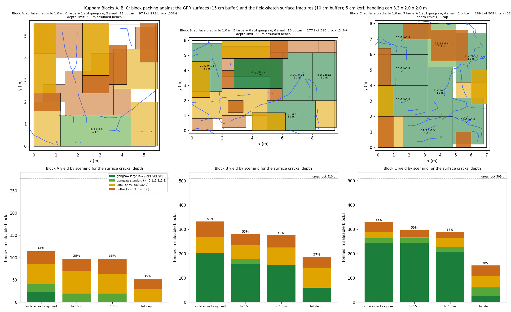

# Kuppam dolerite benches: GPR fracture model, verification, and block yield

Libish M, 10 September 2026. Survey by PARSAN Overseas, 18 to 20 August 2026; report
revised 9 September; raw data received 9 September; this model built 9 and 10 September.

**Interactive model:** https://libishm1.github.io/Kuppam_granite-deposit_GPR-Fracture_study/
(3D, per block, layers with reliability stated; a Cutting view with the straight-cut plan
and its order for the maestry, a Yield view for the office, a Radar view for the
geologist with every raw line and the picks on it; English and Tamil; phone and desktop).
Private copy: https://claude.ai/code/artifact/59ea49e0-aba8-45c8-ac58-595fa29f9424

---

## 1. In one page

Three benches of fine-grained dolerite at Kuppam were scanned with a Proceq GS8000 on
a 0.5 m painted grid: Block A 5.5 x 5.5 m, B 9.5 x 6.0 m, C 7.0 x 8.0 m. PARSAN
interpreted six fracture surfaces. This work re-picked all six from the 178 raw SEG-Y
files, put them on the photogrammetry of each bench by finding the painted grid in the
mesh colours, corrected them to the real bench surface, added the fractures the crew
chalked on the rock, and packed saleable blocks between everything.

| what | result |
| --- | --- |
| six GPR surfaces | all six rebuilt from raw data; of the four with published picks, three tie to the report inside 10 cm and all four inside 20 cm; B-1 and A-2 had no published depths and are checked indirectly |
| position on the rock | each grid found in its mesh to a few cm (A, C) or ~10 cm (B); origins on the crew's painted marks; proven by drawing the model back into the photographs |
| surface cracks | 78 chained traces from the field sketches, 15 to 34 m per block; the photo-based detector was tested and found no better than chance, so it is not relied on |
| yield, surface cracks assumed 1 m deep | A 97 t (35 %), B 277 t (54 %), C 289 t (57 %) in saleable blocks; C carries 7 large gangsaw blocks |
| the biggest unknown | how deep the chalked cracks go: the yield ranges from 65 % to 30 % across that assumption on C, and 41 % to 19 % on A |
| the biggest finding | the steep joint set that will control how blocks split is on the sketches and not in the radar; the radar cannot see it |

Everything here regenerates from `scripts/`. Every figure named below is in `figs/`.

## 2. Data

| item | detail |
| --- | --- |
| instrument | Proceq GS8000 S/N GS80-001-0145; stepped-frequency; HF channel peaks at 628 MHz, LF at 358 MHz (measured from the direct wave on all 89 lines, `tables/spectra.json`; not the report's "500 MHz nominal") |
| lines | 89: A 24, B 33, C 32; 2.49 cm trace spacing; HF 40 ns / LF 81 ns windows |
| coordinates | none in the raw data: every trace header is zero, every line starts at (0, 0). Positions come from the line numbering and the field sketches |
| photogrammetry | three Metashape projects, phone camera, no markers, no scale bars, no GPS; A 2.3 M, B 0.9 M, C 21.5 M vertices |
| field sketches | one per block, the numbered grid with the fractures the crew saw drawn as dashes |

## 3. The six surfaces, and how they tie to the report

Picks were made on the raw radargrams: C-2 by dynamic-programming tracking on all 32
lines with a least-squares adjustment across 230 line crossings; the others by
corridor tracking between PARSAN's published endpoints, so their interpretation sets
the ends and the data fills in between. Velocity 0.1202 m/ns from a diffraction scan
on the blocks themselves (114 well-focused apices below 0.6 m, out of 322 candidates; filter vwidth <= 0.012, t0 > 10 ns in `tables/hyperbola_velocity.csv`), against PARSAN's 0.1200.

| surface | what it is | picks (report) | tie to the report | independent check | carry as |
| --- | --- | --- | --- | --- | --- |
| C-2 | base cap under Block C, 2.77 to 3.57 m | 9,481 (8 ranges) | median 3 cm on their 8 lines | 230 crossings, median 11 cm, 84 % within 20 cm | **good** |
| C-1 | shallow sheet, west half of C, dips 7 deg SE | 1,292 (18) | 8 cm at every end | plane residual 11 cm | **good** |
| B-2 | deep wedge, west of B, dips 22 deg | 969 (12) | 12 cm; dips to 0.3 deg | none possible: one line direction only | caution |
| B-1 | shallow sheet, east of B, dips 7 deg east | 1,580 (none) | five indirect checks pass | HF vs LF on orthogonal lines, 97 % within 20 cm; **confirmed on the rock** by a 4 m chalked crack at its outcrop | **good** |
| A-2 | steep E-W sheet in A, dips 34 deg | 565 (none) | matches described geometry | orthogonal-line check, 0.9 cm median | **good** |
| A-1 | dipping sheet in A, NW, 27 deg | 428 (4) | dip matches once one printed depth order is reversed | position vs chalked cracks no better than chance | caution |

Two corrections to the report came out of this: Line 10's two A-1 depths are printed in
the wrong order (reversing them makes the four published picks coplanar to under a
centimetre and makes the report's own dip arrows correct), and Figure 12's radargram
is inserted upside down.

## 4. Putting the model on the rock

The three photogrammetry meshes have no scale or orientation. The survey grid is
painted on the bench and survives in the mesh vertex colours, and a 0.5 m lattice is
scale, rotation and position in one object. Method: bench plane from paint-coloured
vertices; top-down colour raster; 2D spectrum for the two lattice directions; fold for
phase; a matched window of the known line count for extent.

| block | scale, m per mesh unit | lattice | origin | verified by |
| --- | --- | --- | --- | --- |
| A | 0.7281 | 12 x 12, families 89.9 deg apart | the chalk numerals 9, 10, 11 at the ends of lines 9 to 11, back-projected through the camera poses | reprojection: every drawn line on a lime line |
| B | 1.0138 | frame from the B0, B1, B3 painted crosses, rectangle fit 4 cm rms | B0 cross | reprojection: origin on the cross, outline on the slab |
| C | 0.6745 | 15 x 17, spacings agree to 0.07 % | the C0 cross | reprojection: every drawn line on a red line |

Three corrections were needed, all pointed out from the field: A one cell over, B onto
the central slab rather than the neighbouring one, and C's origin onto the cross rather
than two rows away. The camera poses in the Metashape projects allow any painted mark
to be placed in the model from a photograph, which is what settled all three.

**Limit.** The three blocks are not positioned relative to each other; no mesh
contains another block's grid. A site survey is the only fix.

## 5. The bench is not flat: v2

From the meshes, the bench surface has 27 to 41 cm of relief across each grid and
tilts 1 to 3 degrees. Version 1 of every surface (kept) puts depth below a flat
bench; version 2 puts each pick below the real surface at its own (x, y). The
correction is up to 20 cm either way. On B the surface rises 30 cm across 6 m, so
B-2's true dip is 19.5 degrees, not the 22 measured against the antenna.

## 6. Surface fractures

**Field sketches.** The dashed strokes are the fractures the crew saw, drawn on the
numbered grid, so they are in the survey frame already. Digitised by taking the drawn
lattice as one connected component, mapping through 142 to 260 recovered nodes, and
chaining dashes: A 14 traces / 15.3 m, B 25 / 24.3 m, C 39 / 34.4 m. Positions are
good to the hand-drawn grid, 10 to 30 cm.

**Photographs.** A dark-line detector was run on all 384 posed photos and back-projected
onto the bench. Chalk lines were weeded by a joint test (parallel to a lattice axis and
on a lattice line). Tested against the sketches with a random-line null, the detector
scored 1.04x, 1.34x and 0.77x chance on A, B, C. **It is not relied on.** The sketch is
the surface witness.

**Where the GPR planes reach the surface.** B-1's plane outcrops at x about 2 m on the
west side of B; the crew drew a 4 m crack there; 66 per cent of the outcrop line is
within 30 cm of it against 27 per cent for a random line. A-1 scores at chance. C-1
does not reach any chalked crack. And Block C's largest surface system is a steep
NE-SW network at right angles to C-1 that the radar did not pick.

## 7. Block yield

Voxel packing at 20 cm against the GPR surfaces (15 cm safety) and the chalked cracks
(10 cm safety, extruded vertically to an assumed depth), 5 cm saw allowance, blocks
capped at 3.3 x 2.0 x 2.0 m for handling, density 2.95 t/m3. Classes: gangsaw large
>= 2.7 x 1.5 x 1.5, gangsaw >= 2.1 x 1.2 x 1.2, small >= 1.5 x 0.9 x 0.9, cutter
>= 0.9 x 0.6 x 0.6. Depth limit: the C-2 cap for C; an assumed 3.0 m bench for A and B,
where no floor was surveyed. The production equivalent is `BlockCutOptSolver` in
Frahan.StonePack.Core.

| block | chalked cracks assumed to reach | large | gangsaw | small | cutter | tonnes | of gross |
| --- | --- | --- | --- | --- | --- | --- | --- |
| A | ignored | 1 | 1 | 5 | 9 | 114 | 41 % |
| A | 1.0 m | 0 | 1 | 5 | 11 | 97 | 35 % |
| A | full depth | 0 | 0 | 3 | 8 | 52 | 19 % |
| B | ignored | 6 | 0 | 4 | 6 | 333 | 65 % |
| B | 1.0 m | 5 | 0 | 6 | 10 | 277 | 54 % |
| B | full depth | 2 | 0 | 6 | 11 | 188 | 37 % |
| C | ignored | 8 | 1 | 3 | 6 | 331 | 65 % |
| C | 1.0 m | 7 | 1 | 4 | 5 | 289 | 57 % |
| C | full depth | 1 | 2 | 5 | 9 | 151 | 30 % |

In every block the gangsaw stock lies below the first metre; the chalked cracks carve
the top metre into small and cutter stock. **The depth of the chalked cracks is worth
more tonnage than anything the radar left open.**

### 7.1 A plan the saw can follow: straight cuts only

The table above is free packing: blocks placed anywhere between the surfaces, some of
them impossible to free with a wire saw because a neighbour is in the way of the cut.
A wire saw makes through-planes. The cutting plan is therefore a guillotine tree: the
bench is split by one vertical plane along a grid line or one horizontal plane at a
marked depth, and each half is split again, until a piece is either a clean block or
waste. `scripts/guillotine_pack.py` solves that tree exactly by dynamic programming over
every sub-box on the painted 0.5 m lattice, with depth steps of 0.5 m, the same
forbidden voxels as the free packer, a block classified on its marked size and weighed
after the 5 cm kerf, and an objective that prefers gangsaw stock (weights 1.0, 0.85,
0.55, 0.30 for the four classes) over the same tonnage in cutter stock.

| block | chalked cracks assumed to reach | large | gangsaw | small | cutter | cuts | tonnes | of gross |
| --- | --- | --- | --- | --- | --- | --- | --- | --- |
| A | ignored | 1 | 0 | 6 | 2 | 36 | 65 | 24 % |
| A | 1.0 m | 0 | 0 | 6 | 1 | 36 | 46 | 17 % |
| A | full depth | 0 | 0 | 4 | 1 | 34 | 24 | 9 % |
| B | ignored | 9 | 0 | 7 | 0 | 37 | 296 | 59 % |
| B | 1.0 m | 7 | 0 | 10 | 1 | 57 | 238 | 47 % |
| B | full depth | 2 | 0 | 16 | 0 | 70 | 161 | 32 % |
| C | ignored | 7 | 0 | 13 | 0 | 51 | 279 | 55 % |
| C | 1.0 m | 7 | 0 | 11 | 1 | 58 | 240 | 47 % |
| C | full depth | 0 | 1 | 16 | 2 | 84 | 123 | 24 % |

Against the free packing at 1.0 m, straight cuts keep 86 % of the tonnage on B (238 of
277 t) and 83 % on C (240 of 289 t), and only 47 % on A (46 of 97 t): A's stock is
small pieces between the A-1 sheet and the chalked cracks, and a through-plane cannot
isolate them without cutting a neighbour. The class counts of the two tables are not
directly comparable: the straight plan classifies on the marked size, as a quarry does,
so a block marked 3.0 x 2.0 x 1.5 m (2.95 x 1.95 x 1.45 m after the saw) counts as
gangsaw large, while the free packer classified on the finished size. Tonnage is
comparable; both are after kerf. These are the numbers the interface shows first; the
free packing is shown as the upper bound.

**Order of cutting.** The tree gives the order: the root cut first, then the sub-box on
the east side (larger x) before the west, and within each sub-box the same rule
recursively. Blocks are then removed east to west, top down. On B at 1.0 m the first
three cuts are the vertical plane x = 500 cm to full depth, the vertical plane y = 300
cm across the east half, and x = 700 cm; the first block freed is a small block at
x 800 to 950, y 300 to 600, 1.5 to 2.5 m down, followed by a large gangsaw block at
x 700 to 900, y 0 to 300, 1.0 to 2.5 m down. B needs 57 cuts of which 21 are horizontal,
C 58 (30 horizontal), A 36 (15 horizontal). Every horizontal cut needs a drilled hole at
each end for the wire; the plan lists the depth and the extent of each. The full list,
in order, with each block's marked size, position and depth, is in
`tables/guillotine_packing.json` and in the Cutting view of the interface, which can
also step through the cuts one by one.

**East** is taken as grid +x, the sense PARSAN's report uses on Block B ("dipping toward
increasing X (east)"). No compass bearing of the grid was recorded; the crew should
confirm with a compass before marking, and if east is another grid direction the
removal order flips but the cuts do not change.

## 8. Verification, stage by stage

| stage | test | result |
| --- | --- | --- |
| picks | C-2 at 230 line crossings | median 10.6 cm, 84 % within 20 cm |
| picks vs report | every published endpoint (C-1, C-2, B-2, A-1) | three of the four inside 10 cm, all four inside 20 cm at the median, with C-2 Line 17 a named +25 cm edge outlier; the 8 to 12 cm residual equals the tracking corridor half-width, so their endpoints stand |
| velocity | 114 well-focused diffraction apices below 0.6 m (`hyperbola_velocity.csv`, vwidth <= 0.012 and t0 > 10 ns, of 322 candidates) | median 0.1202 vs adopted 0.1200 m/ns |
| registration | model drawn back into two photographs per block | lattice on paint on all three; origins on the crosses |
| registration scale | painted spacing under the recovered scale | A 0.500 m, C 0.500 m, B 0.515 m (three marks only) |
| bench surface | plane fit and roughness | 1 to 4 cm non-planar residual, 1 to 2 mm roughness at 30 cm |
| sketches | trace length that could be grid ink | 4 to 9 per cent |
| photo cracks | against the sketch, random null | 0.77 to 1.34x chance: rejected as a layer |
| time zero | PARSAN's reply against the raw axis | raw SEG-Y is on the corrected axis; their picks land on it without offset |

## 9. PARSAN's reply of 10 September, tested

| question | answer | verdict |
| --- | --- | --- |
| Figure 2 vs Table 1 | 1.67 ns is time-zero corrected; 4.74 is the display; use corrected | closed; the model already was |
| Block A lines 1 to 12 | fixed y | closed; matches the model |
| A-2 depth | 0.50 to 1.35 m | consistent with the model |
| B-1 depth | 0.997 to 1.953 m | **does not match** the report's own slice windows (0.47 to 1.02 m), Figure 12 (0.45 to 0.95 m), or the raw data, which tracks the sheet at 0.55 to 0.68 m on both channels with no seed. The 0.46 to 0.97 m surface stands; this is the one item to put back |

## 10. What the radar can and cannot do here, and what to do about the rest

The GPR resolves layering at a quarter wavelength, 5 cm (HF) to 8 cm (LF) in this
rock, and detects a thin open or wet joint well below that. What it cannot do is see a
steep joint from the surface: a plane dipping more than about 45 degrees returns
almost nothing to an antenna above it, and at 0.5 m line spacing anything steeper than
7 degrees aliases in the slices. That is why all six surfaces PARSAN found are gently
to moderately dipping, and why the steep NE-SW set in Block C is on the sketch only.
The hairline, closed, dry fractures that decide whether a slab survives the gangsaw are
below the detectability of any surface radar.

What helps, in order of cost:

1. **Chalk and photograph, properly.** The crew's chalking is already the best surface
   record. Wet the bench first: hairline cracks hold water and show dark for minutes.
   Chalk every one, then photograph each block from directly above with a scale bar
   and the same phone. That turns a sketch with 10 to 30 cm of wobble into a map good
   to a centimetre, and it costs an hour per block.
2. **Log every sawn face.** Each cut exposes the rock the model predicted. Photograph
   the face against the grid and mark where the surfaces actually were. This is the
   only way to learn how deep the chalked cracks run, which is the number that moves
   the yield most.
3. **One core through C-2** near Line 22 or Line 11, as the report recommends three
   times. It calibrates depth by measurement.
4. **Tape, compass and a level** over the three grid origins. The blocks then sit in
   one frame with a common datum, which no amount of processing can supply.
5. A 1 to 2 GHz surface scan of the top half metre, if the shallow stock matters:
   2.5 cm resolution, and it sees the wet hairlines that 600 MHz does not.

## 11. Deliverables

| where | what |
| --- | --- |
| `dataset/bench_frame_m/Block_X/` | per block, one metric frame: point cloud (PLY), six surfaces v1 and v2 (OBJ, DXF), the lattice, the DEM, the chalked cracks on the DEM, `FRAME.json` |
| `dataset/report_frame/` | the surfaces in PARSAN's own x, y for Rhino |
| `dataset/picks/` | every per-trace pick with two-way time retained; the resolved geometry of all 89 lines |
| `tables/block_packing.json` | every packed block, every scenario (free packing, the upper bound) |
| `tables/guillotine_packing.json` | the straight-cut plan: every cut in order with its extent, every block with its removal order |
| `web/site/index.html`, the GitHub Pages link above | the interface, one file, English and Tamil |
| `web/panels/` | every raw radargram as a panel, HF and LF, for the Radar view |
| `AUDIT.md`, `MODEL.md`, `VERIFICATION.md` | the working documents this report condenses |

## 12. Assumptions that should be revisited

- Bench height 3.0 m for A and B: no floor was surveyed. Change `MAXDEPTH` in
  `scripts/block_pack.py`.
- Chalked cracks are vertical to the assumed depth. They may dip.
- Safety margins 15 cm (GPR) and 10 cm (chalk) are the surfaces' own accuracies, not
  a saw's tolerance; add whatever the sawyer wants.
- Unmigrated positions: B-2 at 22 degrees sits up to 1.4 m from its true plan position
  at depth, per the report's own convention.
- Density 2.95 t/m3, unmeasured.
