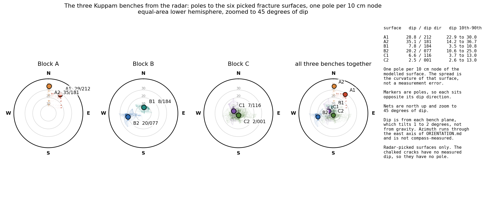

# Joint mapping from the Kuppam photogrammetry: what the existing models can and cannot give

An independent study, separate from the GPR work in `outputs/2026-09-09/gpr_raw_audit/`. Nothing
here is published to the quarry interface or to the public repository. The question: the radar does
not constrain steep fractures, and the chalked surface cracks have unknown dip and unknown depth.
The pit walls are already photographed. Can the joint sets be read off the photogrammetry we
already own, without going back to site?

Short answer: partly, and the limits are worth knowing before anyone plans a field trip.

## What we have

| model | vertices | extent in its bench frame | what it really covers |
| --- | --- | --- | --- |
| Block A | 2 269 489 | 16 x 17 x 9 m | the A bench and the walls around it |
| Block B | 903 594 | 26 x 22 x 4.5 m | the B bench, a low pit, walls only 4 m high |
| Block C | 21 561 110 | 49 x 48 x 21 m | **the whole site**: benches, haul ramp, and the full pit walls |

The three are separate Metashape projects in unrelated frames. Each was brought into its own bench
frame (metres, z up, painted bench top at z = 0) with the transform already fitted for the GPR
study. Block C's model is the one that matters: it is effectively a site model with 21 m of
vertical relief, and 93 per cent of its points are off the painted bench.

Every vertex carries colour, so the same data supports both routes below.

## Route 1: fit planes to the rock surface (facets)

`scripts/facets.py`, after Dewez's FACETS and Riquelme's DSE: voxel downsample, local PCA for
normals and planarity, region-grow planar patches over the K nearest-neighbour graph, refit by SVD.
`scripts/sets.py` then clusters the poles with axial k-means and reports each set.

| model | facets | total area | flagged as probable saw-cut faces |
| --- | --- | --- | --- |
| A | 223 | 365 m2 | 10, covering 263 m2 |
| B | 279 | 542 m2 | 22, covering 349 m2 |
| C | 1042 | 2123 m2 | 78, covering 1351 m2 |

**This route mostly finds the quarry, not the rock.** Two thirds of the mapped area on every model
is man-made. A wire-sawn wall is a plane, a worked floor is a plane, and both are larger and
flatter than any natural joint face, so they dominate the statistics.

One near-miss is worth recording as a warning. Clustering Block B gave a sub-horizontal set at dip
6.7 degrees toward azimuth 83, against the radar's B-1 surface at dip 6.9 toward 84. That looked
like an independent confirmation of the radar. It is not. Splitting those facets by elevation shows
they sit between z = -0.3 and +1.1 m and average 1.6 degrees: they are the quarry floor around the
bench, and the apparent 6.7 came from the cluster mixing floor patches with sloping rubble. None of
them lie inside the painted footprint. The agreement was a coincidence.

A second limit is structural, not a matter of method. The walls stand **above** the bench tops,
while every radar surface lies **below** them. Block B has no exposure deeper than 0.4 m below its
bench and Block A none that is usable. So the faces cannot confirm where B-1 or A-1 actually sit.
They can only give the orientation of the sets, on the usual assumption that a set continues.

## Route 2: read the fracture traces off the sawn faces

This is the better route, and it was the client's suggestion. On a sawn wall a fracture does not
appear as a facet; it appears as a line. `scripts/face_traces.py` takes each large face, pulls every
full-resolution vertex within 15 cm of its plane **and inside that facet's own extent**, and
rasterises two images in the plane of the face at 2 cm per pixel: mean photographic colour, and
relief about the plane. A multi-scale Sato ridge filter with hysteresis thresholding picks dark
lineaments from the colour and grooves from the detrended relief, the result is skeletonised, and
each connected piece that is close to straight becomes a 3D segment on the face.

Two corrections mattered. Detection must be confined to the data footprint, closed and then eroded,
or the ragged edge of the reconstruction is itself picked up as a fracture. And each raster must be
clipped to its own facet, or one plane collects every fragment of wall that happens to touch it: on
Block C that lifted usable coverage from 5 to 11 per cent up to 65 to 91 per cent.

On the site model: **45 faces, 203 traces longer than 0.4 m.**

### Separating the saw from the rock

A wire saw and a drill line leave lineations parallel to one another, near-vertical on a vertical
face. A fracture has no reason to be parallel to them. Within each face the length-weighted rake
histogram is taken, its dominant mode is called tooling, and traces within 12 degrees of it are set
aside: **65 traces of the 203, leaving 138 candidates.** Eighteen of the 40 faces show a mode strong
enough to call.

### A trace is a line, not a plane

A trace on one flat face fixes a line. Any plane containing that line is possible, so a single
trace cannot give dip and dip direction. Two traces of the same fracture on two faces that are not
parallel do fix it. Pairs are formed across faces more than 25 degrees apart, closer than a chosen
gap, and coplanar to 25 cm.

**The null matters more than the count.** Redrawing every trace direction at random inside its own
face, keeping positions and face geometry, gives the number of coplanar pairs that chance supplies:

| pairing gap | pairs found | expected by chance | probability of the result |
| --- | --- | --- | --- |
| 1 m | 1 | 0.5 | 0.34 |
| 2 m | 1 | 0.7 | 0.48 |
| 4 m | 2 | 1.6 | 0.46 |
| 8 m | 22 | 8.3 | 0.000 |
| 15 m | 57 | 33.1 | 0.005 |

At short baselines there are too few pairs to say anything. At 8 m there are 22 against an expected
8.3, and 200 random draws never reached 22. So real coplanar structure is there, but roughly two in
five of those 22 planes are accidents and **no individual plane can be trusted.**

### Where the excess sits

Binning observed and pooled-null poles the same way:

| dip band | observed | expected per draw | excess |
| --- | --- | --- | --- |
| 0 to 20 deg | 4 | 1.5 | +2.5 |
| 20 to 40 deg | 4 | 2.0 | +2.0 |
| **40 to 60 deg** | **9** | **1.8** | **+7.2** |
| 60 to 75 deg | 0 | 1.5 | -1.5 |
| 75 to 90 deg | 5 | 1.5 | +3.5 |

The signal is a population of **moderately dipping fractures, 40 to 60 degrees**, which is exactly
the population that falls between what the radar resolves well (the gently dipping surfaces, 2 to
22 degrees) and what it cannot constrain at all (the steep set).

Their orientations do not form one tight set. The nine split into six dipping north-east
(azimuth 28 to 69) and three dipping south-west (azimuth 224 to 251), mean dip 46 degrees, Fisher K
only 2.7. That pattern is what a conjugate pair looks like, and it is also what mirrored false pairs
across the two walls of a trench look like. With nine members of which about two are expected to be
accidental, the data cannot tell those apart. Every azimuth in this study is conditional on the
unresolved east question below.

## Does the radar show up in the photogrammetry?

Asked directly, because both sit in the same frame already: the GPR surfaces were modelled in each
block's bench frame and the photogrammetry of that block was brought into the same frame, so no
registration is involved. `scripts/radar_vs_photo.py` fits each GPR surface as a plane in absolute
bench-frame elevation, extends it beyond the picked footprint, and asks of every exposed facet
whether its pole agrees to 15 degrees (orientation), whether it lies within 30 cm of the extended
plane (proximity), or both (continuation). Two nulls of 500 draws each: spin keeps the dip and
re-draws the dip direction, shift keeps the orientation and slides the plane along its own normal
anywhere in the elevation range the photogrammetry covers.

| surface | dip / dip dir | picked elevation | orientation | proximity | continuation | inside the footprint | of those, up on a face | shift p |
| --- | --- | --- | --- | --- | --- | --- | --- | --- |
| A1 | 28.8 / 148 | -3.29 to 0.03 m | 28 | 17 | 1 | 0 | 0.0 m2 | 0.354 |
| A2 | 35.1 / 179 | -1.85 to -0.28 m | 29 | 1 | 0 | 0 | 0.0 m2 | 1.000 |
| B1 | 7.8 / 184 | -1.04 to -0.43 m | 77 | 53 | 10 | 0 | 0.0 m2 | 0.136 |
| B2 | 20.2 / 77 | -3.86 to -1.78 m | 61 | 62 | 22 | 0 | 7.9 m2 | 0.000 |
| C1 | 6.6 / 206 | -1.17 to -0.26 m | 220 | 116 | 59 | 0 | 6.3 m2 | 0.000 |
| C2 | 2.5 / 91 | -3.74 to -2.72 m | 225 | 0 | 0 | 0 | 0.0 m2 | 1.000 |

**No. None of the six surfaces can be seen in the photogrammetry.** Read the last three columns
rather than the p values. Not one match, for any surface, falls inside the footprint that was
actually picked. Every match sits out on the quarry floor beside the bench, or on the low rim just
above it.

That is why the p values mislead. B-1 and C-1 are near-horizontal planes sitting a few tens of
centimetres below the bench top; extend either one sideways and it crosses floor level somewhere
out in the pit, and the floor is paved with near-horizontal facets. So the shift null is beaten
easily while the finding is worthless. Of C-1's 59 continuation matches, 50 lie at floor level. Of
B-1's 10, all 10 do.

B-2 is the only one with anything at all off the floor: 9 facets totalling 7.9 m2, correctly
oriented and within 30 cm of the extended plane, against a shift null of 0.88. They sit at 0.4 to
0.7 m above the bench, which is the low rim beside Block B rather than a wall, and 7.9 m2 spread
over 9 small patches is not a daylighting. It is worth one look on site, nothing more.

C-2 returns exactly zero on every test, which is the sanity check working: it lies 2.7 to 3.7 m
below the bench, dips 2.5 degrees, and never reaches daylight anywhere in the model.

The reason is structural and no amount of processing will change it. **The photogrammetry sees rock
above the bench tops and the worked floor around them. Every radar surface lies below a bench top
and inside a block footprint, where there is no exposure at all.** To see a radar surface in an
image, someone has to cut into the bench first. That is the freeze-and-compare experiment, and it
cannot be done retrospectively on this data.

## A stereonet of the three benches, from the radar alone

`scripts/stereonet_radar.py`. The six modelled surfaces are gridded at 10 cm, so every node has a
local orientation and the sheet carries a real spread instead of six lonely points. The spread is
the curvature of the modelled surface, not a measurement error. Markers are the least-squares plane
of each surface, which reproduces the elevation-frame dips already published in the uncertainty
ladder to within 0.6 degrees. The chalked cracks are excluded: their dip has never been measured,
so they have no pole.

| surface | dip | dip direction | local dip, 10th to 90th | Fisher K |
| --- | --- | --- | --- | --- |
| A-1 | 28.8 | 212 | 22.9 to 30.0 | 260 |
| A-2 | 35.1 | 181 | 14.2 to 36.7 | 88 |
| B-1 | 7.8 | 184 | 3.5 to 10.8 | 253 |
| B-2 | 20.2 | 077 | 10.6 to 25.0 | 146 |
| C-1 | 6.6 | 116 | 3.7 to 13.0 | 166 |
| C-2 | 2.5 | 001 | 2.6 to 13.0 | 93 |

Three sign conventions had to be fixed to get this right, and they are worth writing down because
the first two were wrong in the first version of every script in this folder.

1. The upward normal of a surface leans toward the **down**-dip side, so the dip direction is
   `atan2(n_x, n_y)`, not its negative. Getting this backwards puts every dip direction 180 degrees
   out.
2. A grid bearing becomes an azimuth through the handedness in `ORIENTATION.md`, not through a
   single offset. On A, +x is east and +y is south, so azimuth = 180 minus bearing. On B and C, +y
   is east and +x is south, so azimuth = bearing plus 90. C moved into the second group on
   12 September, when the client verified from the site photographs and from the surveyors' sketch
   correlated to the photogrammetry mesh that C0 to C1 faces the ramp and is the 8 m side; C-1 and
   C-2's dip directions above changed with it. A was moved into that group the same day on a
   misreading and moved back within two hours: the crew's numbering on the ground - X-line numerals
   9, 12 ... painted down the west edge from A0 - puts A's X-lines stacked north to south and
   running east, so +x is east on A and A stays left-handed. A-1 and A-2 above are as they were.
   In every case the **dips did not change**, because dip is frame-independent. Both C surfaces are
   under 7 degrees of dip, so neither of their dip directions carries much weight.
3. A stereonet drawn north up cannot be plotted in grid axes. The poles have to be rotated out of
   the grid first, or the compass labels are decoration.

**One consequence reaches the published work.** With east on Block B taken as +y, B-1 dips toward
azimuth 184, which is south. The surface is named "B-1 shallow sheet, dips east" on the live page
and in the report. That name was written when east was taken as +x, before the orientation note,
and it was not revisited. It is wrong under the current reading and needs correcting whichever way
the question below is settled.

## The east axis is not settled after all

`scripts/icp_site.py` registered the A and B models into C's frame by exhaustive yaw search with
FFT translation scoring, then point-to-plane ICP. Both converge well: Block A at 4.9 cm rms with
90.3 per cent of points within 10 cm, Block B at 4.3 cm rms with 96.3 per cent. Yaw is the
best-determined parameter, with a half-width at 90 per cent of peak of 0.5 degrees for A and 1.5
for B.

That registration makes a prediction that can be checked against `ORIENTATION.md`. Taking the two
solved yaws, in C's frame:

| comparison | angle |
| --- | --- |
| A's +x against B's +x | 14 degrees |
| A's +x against B's +y | 104 degrees |

So the two grids were painted with their **x axes nearly aligned on the ground**. `ORIENTATION.md`
concluded that A's +x is east and B's +y is east, which requires those two axes to be parallel and
predicts the opposite of what the registration finds. If A's +x is east, as photograph 113557
indicates, then B's +x is also roughly east, which is the contractor's original reading and not the
one now on the page.

This does not overturn the orientation note on its own. The registration carries real weaknesses:
its second-best minimum is a 6.5 m slide along the bench at almost the same yaw, the A-B-C triangle
fails to close by 6.6 m because the B-to-A leg is undetermined, and both vertical offsets came out
within 2 cm of zero, which is suspicious for two benches at different levels. But a translation
slide at constant yaw does not change the axis comparison, and the yaw landscape for B is a single
sharp spike in which 270 degrees, the value the +y reading needs, ranks 171st of 180.

Two independent lines now disagree, and only about Block B. The photographs of A and C are not in
question. **A compass on the three grid origins settles it in a minute and should be done before
anything is marked on the rock.** Until then the east axis should be treated as open. The cuts
themselves do not depend on it; the order of removal and every azimuth in this study do.

## What this does and does not establish

Established:

- The site model carries enough exposed rock to work on, and the method runs end to end.
- Traces on the sawn walls contain coplanar structure well above chance at an 8 m baseline.
- There is a moderately dipping fracture population at 40 to 60 degrees that the radar survey does
  not describe.
- Two thirds of the planar area in every model is man-made, and any joint statistics that ignore
  that are wrong.

Not established:

- Any individual fracture plane. About 40 per cent of the pairs are accidents.
- Whether the 40 to 60 degree population is a conjugate pair or one set plus noise.
- Natural block size. That needs a closed polyhedral network, and the steep set is still not
  resolved well enough to close one.
- Any confirmation of where the radar surfaces sit, because the walls expose rock above the bench
  tops while every radar surface lies below them.

## Two caveats that apply to every number here

Dip is measured from each block's own bench plane, not from gravity. The benches tilt 1 to 2
degrees, so that is a systematic on every dip. Azimuth comes from the east axis established in
`ORIENTATION.md`, not from a compass.

## What would fix it, in order

1. **Photograph the walls deliberately.** The existing models were shot to cover the bench tops, so
   the walls are grazing-angle and patchy. An hour walking the pit with the camera aimed at the
   faces would turn a 40 per cent false-pair rate into a usable map. This is the cheapest action on
   the list by a wide margin.
2. **Photograph the corners.** The pairing needs faces that are not parallel, and the pit is mostly
   two parallel walls. Corners, re-entrants and the bench-to-wall junction are where a single
   fracture shows on two different faces and its plane is fixed outright.
3. **A compass and a clinometer on two or three faces.** That converts every dip in this study from
   bench-relative to true, and checks the azimuth chain at the same time.
4. **Trace a chalked crack over the bench edge.** A crack mapped on the bench top and followed down
   the adjacent face gives its true dip, which is currently carried as an assumption.

## Files

| what | where |
| --- | --- |
| meshes cached in bench-frame metres | `cache/mesh_{A,B,C}.npz` |
| facet extraction | `scripts/facets.py`, `tables/facets_*.json` |
| set clustering and stereonets | `scripts/sets.py`, `tables/sets_*.json`, `figs/STEREONET_*.png` |
| face rasters and trace detection | `scripts/face_traces.py`, `tables/traces_*.json`, `figs/FACE_C_*.png` |
| traces to planes, with the null | `scripts/traces_to_planes.py`, `tables/planes_C.json`, `figs/TRACES_C.png` |
| excess over the null by dip band | `scripts/excess.py`, `tables/excess_C.json`, `figs/EXCESS_C.png` |
